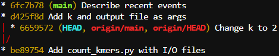
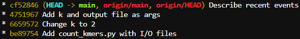

# <ins>Домашнее задание 1. Git, github, CI/CD.</ins>

## Задание 2. Работа с git.
Добавлено:
**complement.py** &ndash;  принимает на вход с командной строки нуклеотидную последовательность и печатает её reverse complement и GC-состав до 3 знака после запятой. 

## Задание 3. Работа с конфликтами.
Написан скрипт **count_kmers.py** для подсчёта 4-меров в fasta-файле и отправлен в репозиторий вместе с примером входного и выходного файла. k и имя выходного файла в скрипте заданы вручную как переменные.

Далее через UI на Github значение k изменено с 4 на 2 и закоммичено. Следом без предварительного ```git fetch``` структура кода на локальной машине модифицирована так, что теперь он принимает на вход не только название входного файла, но название выходного файла и значение k; тоже с коммитом (даже двумя).

При попытке отправки в репозиторий ожидаемо возникает конфликт из-за различных изменений в одном и том же файле в локальном и удалённом репозитории (скриншот вместо кода для разнообразия и цветопередачи):


Дабы сохранить более продвинутую версию скрипта, то есть ту, что на локальной машине, принято решение перебазировать локальные изменения поверх удалённых:

```bash
$ git pull --rebase origin main
```
```
...
Auto-merging hw1/count_kmers.py
CONFLICT (content): Merge conflict in hw1/count_kmers.py
error: could not apply d425f8d... Add k and output file as args
hint: Resolve all conflicts manually, mark them as resolved with
hint: "git add/rm <conflicted_files>", then run "git rebase --continue".
```

Конфликт сохраняется. Хорошо, что после попытки ```rebase``` в проблемном скрипте становятся прописаны изменения из обоих коммитов:

```python
<<<<<<< HEAD
# outf = args.out
outf = "out.json"
# k = args.k
k = 2
=======
outf = args.out
k = args.k
>>>>>>> d425f8d (Add k and output file as args)
```

В соответствии с подсказками устраняем конфликт, вручную убрав кусок из удалённого коммита, после чего останется следующее:

```python
outf = args.out
k = args.k
```

После ```git add count_kmers.py``` и ```git rebase --continue``` всё успешно отправляется в репозиторий. В логе видно, как актуальные коммиты красиво перебазировались:
|| ```git log --graph --oneline --all``` |
|:---|:---|
| До ```git rebase --continue``` |  |
| После ```git rebase --continue``` и ```push``` |  |

## Задание 5. Практика работы с ветками.
Добавлено:
**lgb.sh** &ndash; содержит цепочки комманд (наиболее короткие из возможных) для решения туториалов на learngitbranching.js.org, симулирующих ветки в системе git и операции над ними. Формат следующий:

```bash
# <Имя блока>
# <Номер задания в блоке>
<первая команда>; ...; <последняя команда>
```

В файле опущены выбранные варианты действий в UI, раскрывающемся по команде ```git rebase -i```. Также там встречается специфичное для данного ресурса обозначение **o** вместо **origin** и команда ```fakeTeamwork n```, которая соответствует добавлению n коммитов в удалённом репозиториии.

## Задание 6. Автоматизация через Github Actions.
