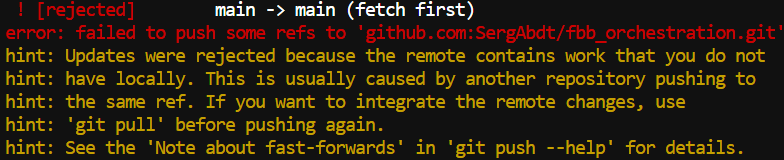

# <ins>Домашнее задание 1. Git, github, CI/CD.</ins>

## Задание 2. Работа с git.
Добавлено:
**complement.py** --  принимает на вход с командной строки нуклеотидную последовательность и печатает её reverse complement и GC-состав до 3 знака после запятой. 

## Задание 3. Работа с конфликтами.
Написан скрипт для подсчёта 4-меров в fasta-файле и отправлен в репозиторий вместе с примером входного и выходного файла. k и имя выходного файла в скрипте заданы вручную как переменные.

Далее через UI на Github значение k изменено с 4 на 2 и закоммичено. Следом без предварительного **fetch** структура кода на локальной машине модифицирована так, что теперь он принимает на вход не только название входного файла, но название выходного файла и значение k.

При попытке отправки в репозиторий происходит следующее:



Дабы сохранить более продвинутую версию скрипта, то есть ту, что на локальной машине, принято решение сделать форсированный push, грязно обнулив старания воображаемого коллеги:

```

```

## Задание 4. Создание PR.

## Задание 5. Практика работы с ветками.

## Задание 6. Автоматизация через Github Actions.
